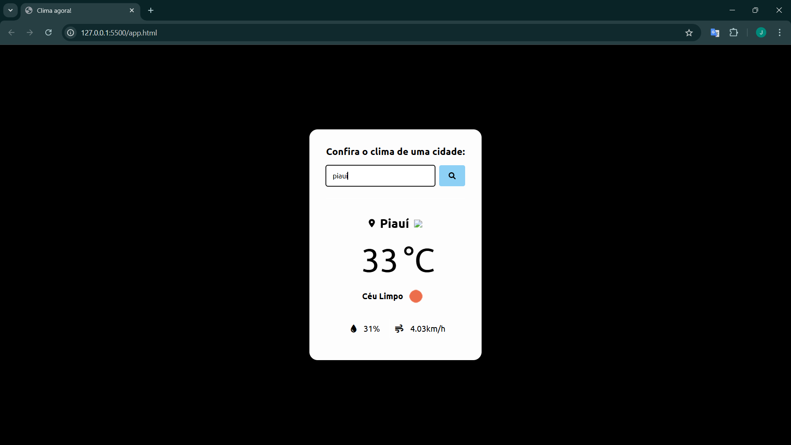

##Image of Software
#WeatherAPI


## How to clone and run the project locally
1. **Clone the repository**
   
   Use the command below in your terminal to clone the repository:
   ```bash
   git clone https://github.com/jefersonprimer/weather-api_js.git

2. **Enter the project folder**
   ```bash
   cd weather-api_js
